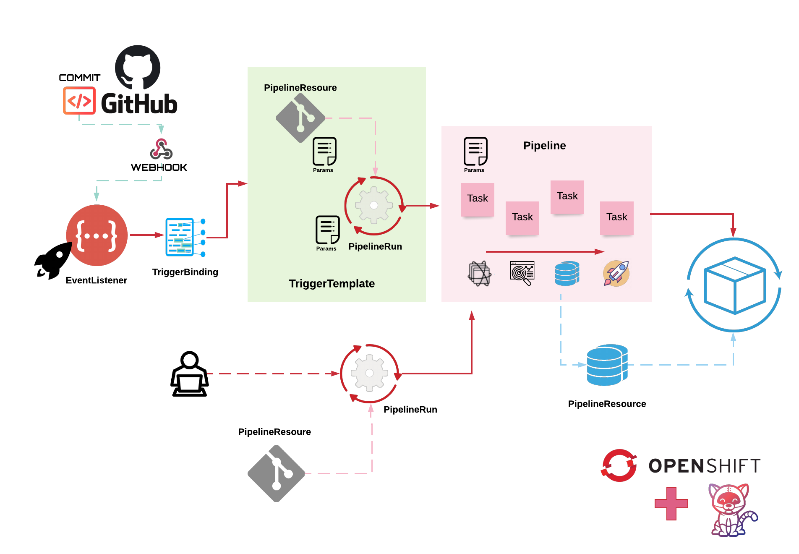

# Tekton - OpenShift Pipelines

Tekton is a powerful and flexible open-source framework for creating CI/CD systems, allowing developers to build, test, and deploy across cloud providers and on-premise systems (Kubernetes, serverless, VMs, etc) by abstracting away the underlying details.

OpenShift Pipelines is a cloud-native, continuous integration and delivery (CI/CD) solution for building pipelines using Tekton. The following list includes some features which are key in this new CI/CD pipelines generation:

-   Standard CI/CD pipeline definition based on Tekton
-   Build images with Kubernetes tools such as S2I, Buildah, Buildpacks, Kaniko, etc
-   Deploy applications to multiple platforms such as Kubernetes, serverless and VMs
-   Easy to extend and integrate with existing tools
-   Scale pipelines on-demand
-   Portable across any Kubernetes platform
-   Designed for microservices and decentralized teams
-   Integrated with the OpenShift Developer Console

This repository tries to give a brief summary of the most basic and important concepts in Tekton including some examples of these objects.

On the other hand, this repository implements a simple example about how to create and run a NodeJS pipeline for managing the continuous deployment of this containerized app on OpenShift handling a emulated GitHub webhook request to kickoff a PipelineRun.

## First Steps

First of all, it will be required a set of elements in order to be able to implement the example or create any example object:

-   An OpenShift 4 Cluster installed (\*It is possible to use CRC)
-   OpenShift Pipelines (Tekton) installed
-   `oc` and `tkn` clients installed
-   A GitHub repository URL with a NodeJS App its valid credentials

## Tekton Objects

Tekton defines a number of Kubernetes custom resources as building blocks in order to standardize pipeline concepts and provide a terminology that is consistent across CI/CD solutions. The custom resources needed to define a pipeline are listed below:

-   PipelineResource -> inputs (e.g. git repository) and outputs (e.g. image registry) which should be used during a Pipeline execution
-   Task -> a reusable, loosely coupled number of steps that perform a specific task (e.g. building a container image, perform a code test, etc)
-   Pipeline -> a set of Tasks which should be performed using some PipelineSources
-   PipelineRun -> a pipeline execution
-   TriggerTemplate -> a set of PipelineResources created dynamically based on an event. Typically, an event is a webhook event (commit, pull_request, etc)
-   TriggerBinding -> a map which enables users to capture fields from an event and store them as parameters (e.g. Commit ID in a webhook event when a repository commit/push event is performed)
-   EventListener -> a HTTP service which listens for events

The following graph describes how these Tekton objects interact with each other:

### ServiceAccounts

A part of main Tekton objects, a group of service accounts are required in order to perform several actions in Kubernetes (Openshift). The following list include some roles or service accounts which will be integrated in the namespaces:

-   Tekton Objects Manager -> This service account creates all tekton related objects in Openshift (\*Operator created "pipeline" by default)
-   Git Repository Manager -> This service account is able to interact with a Code Repository (Git)
-   Docker Repository Manager -> This service account is able to interact with a Container Images Repository (\*When it is required)
-   App Objects Manager -> This service account creates and manages all Openshift objects which will be part of the application deployment.

Please, visit [Tekton Authentication Objects Management](https://github.com/tektoncd/pipeline/blob/master/docs/auth.md) for more information about external components authentication in Tekton.

## NodeJs application CD example

This section tries to give an example about how to implement continuous deployment in a microservice based application in Openshift. This application is based on Javascript language and it is deployed using NodeJS Red Hat official container image in order to build de application.

Please, visit [link](./nodejs-cd-example/README.md) in order to egt the instruction of the example implementation.

## Other Examples

Finally, it is possible to find some Tekton Objects definitions in [example folder](./examples).

## License

BSD

## Author Information

Asier Cidon
